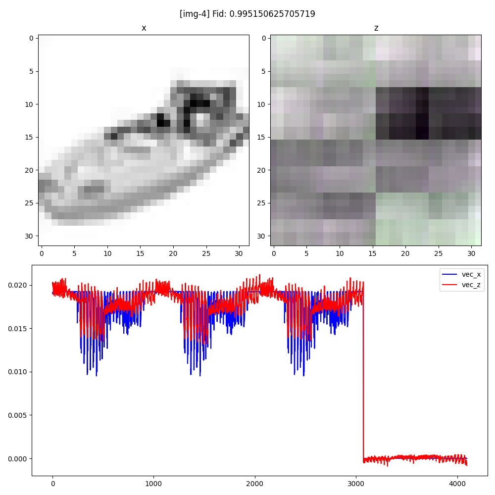
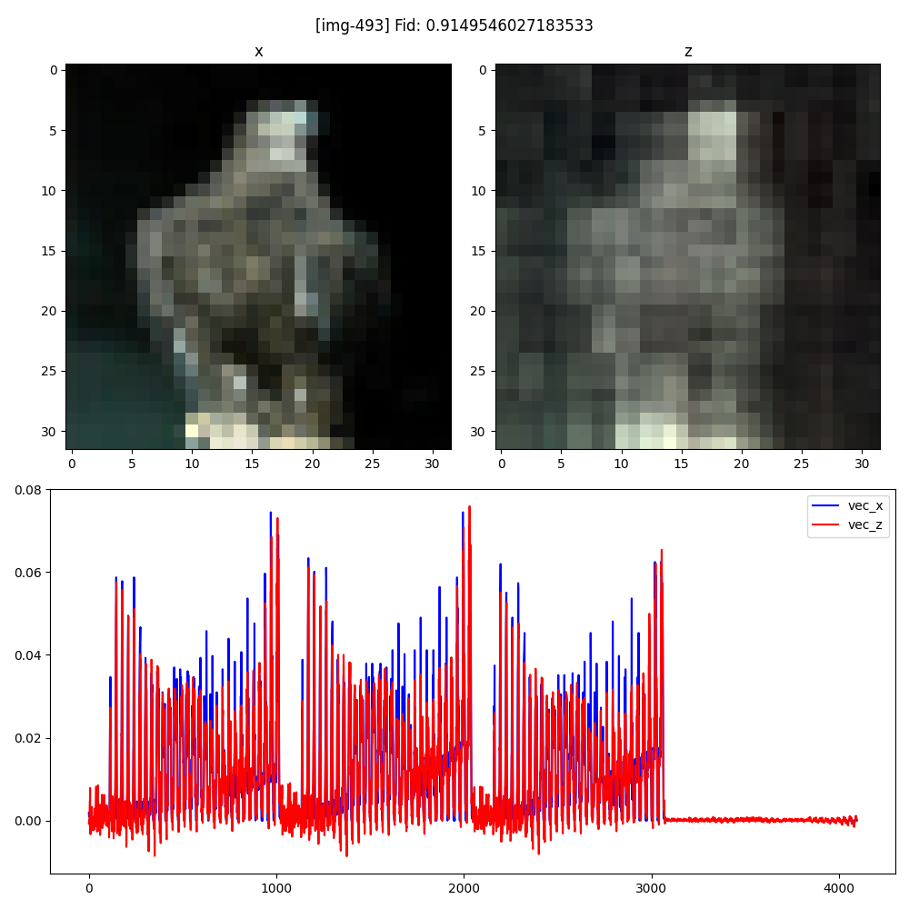

# wtf-quantum-fidelity

    你这个保真度真的保真吗？

----

故事：在打[这个比赛](http://ac-innovation.com/entryInformation/entryDetail?_t=texBUA9y%2BdZhRtD8%2FqAteuRK4wxWuHixgeftjct5SM0%3D)的过程中，我们尝试用某个VQC来拟合CIFAR10数据（以振幅编码的形式），现在来看看拟合结果恢复回图像的样子...

⚠⚠⚠ **WTF you call this HIGH/LOW fidelity??!**

| high-fid-fuzzy-visual | low-fid-clear-visual |
| :-: | :-: |
|  |  |

ℹℹℹ **And you can even predict this fidelity value!** (img -> fid)

| model | theoretical fidelity estimate error | actual fidelity estimate error |
| :-: | :-: | :-: |
| resnet18 | ±0.004602993408407657 | 0.0028561596719686704 |
| vgg11    | ±0.018334930729303735 | 0.0140461407758442    |

### ToDo List

- 原地解压 `data\test_dataset.7z`
- run `python vis.py` 逐张查看编码恢复出来的图像 (已按 fid 降序排序)
  - 寻找 fid 高但模糊，fid 低但是清晰 的图
  - 思考 fid 这个指标到底衡量了什么，怎样的图像对于 VQC 而言是容易拟合的 (即 fid 高)
  - 如何衡量数据复杂度：尝试直接建模预测 fid，比如用 vgg11/resnet18！

----
by Armit
2024/10/24
